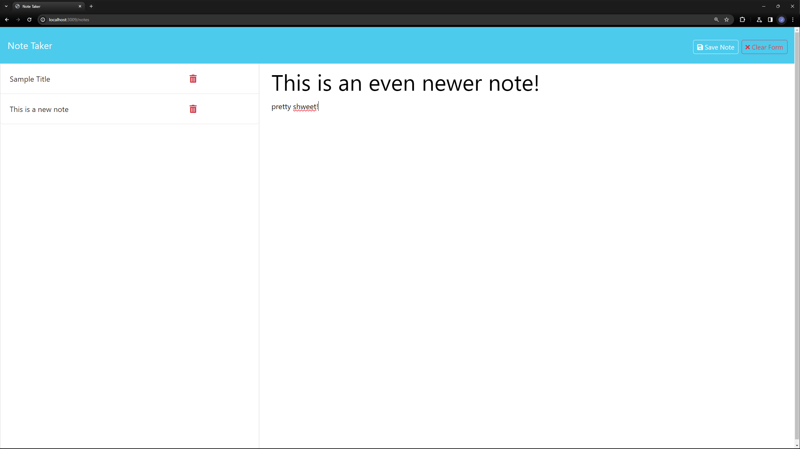

# ExpressNote
  
  </br>
  </br>
  </br>
  ## Description
  
  The purpose of this project is to be able to keep track of notes in one location. Not only should I be able to create functional notes, but also delete them when I am done with them, edit them as changes arise, and clear the form if I decide I no longer want to create a note. It's a very easy to use, simple application that is perfect for anyone who needs to keep track of notes in one location. The entirety of this application was built using basic HTML, CSS, and JavaScript as well as utilizing the Express.js framework.
  </br>
  </br>
  </br>
  ## Table of Contents
  
- [Notation App](#notation-app)
  - [Description](#description)
  - [Table of Contents](#table-of-contents)
  - [Installation](#installation)
  - [Usage](#usage)
  - [Credits](#credits)
  - [Features](#features)
  - [How to Contribute](#how-to-contribute)
  - [Tests](#tests)
  - [License](#license)
  - [Questions](#questions)
  ## Installation
  
  To install this application, access the code repository and copy it using the SSH key that you have linked to GitHub (for more information on this, please visit the <a href="[link](https://docs.github.com/en/authentication/connecting-to-github-with-ssh/adding-a-new-ssh-key-to-your-github-account)">GitHub documentation</a>).
  </br>
  </br>
  </br>
  ## Usage
  To view the finished product, click this <a href="https://notation-app-2aea203684b5.herokuapp.com/">link</a>. To run the application locally, clone the repository to your local machine. Open the terminal and navigate to the root directory of the repository. Run the command `npm install` to install the necessary dependencies. Once the dependencies are installed, run the command ```npm run dev``` to start the server.
  
  Once the server is locally running on your machine, navigate to the localhost port to view the application's homepage.<br>Enter notes and associated text to add them to your list of notes.<br>To delete a note, click the trash can icon to the right of the note.<br>To create a new note, click the 'new note' icon in the top right of screen.<br>To clear a note that is currently being edited, click the 'clear form' icon located next to the new note icon.<br>To edit a note once you have cleared it, click the note you would like to edit and make changes to the text in the text area. Once you are finished, click the save icon to save the changes.
  
  </br>
  </br>
  </br>
  ## Credits
  
  - <a href="https://chat.openai.com/">ChatGPT 3.5</a>
  - <a href="https://github.com/features/copilot?ef_id=_k_CjwKCAiAq4KuBhA6EiwArMAw1FOutqMK0saZxH8FwReh32EgrB9jOkJA2Gi0O3-RqIINbuOsOHKHhxoCfKwQAvD_BwE_k_&OCID=AIDcmmc3fhtaow_SEM__k_CjwKCAiAq4KuBhA6EiwArMAw1FOutqMK0saZxH8FwReh32EgrB9jOkJA2Gi0O3-RqIINbuOsOHKHhxoCfKwQAvD_BwE_k_&gad_source=1&gclid=CjwKCAiAq4KuBhA6EiwArMAw1FOutqMK0saZxH8FwReh32EgrB9jOkJA2Gi0O3-RqIINbuOsOHKHhxoCfKwQAvD_BwE">Github CoPilot</a>
  - <a href="https://developer.mozilla.org/en-US/">MDN</a>
  - <a href="https://leewarrick.com/">Lee Warrick</a> UCONN Bootcamp Instructor
  - <a href="https://github.com/miacias">Mia Ciasullo</a> UCONN Bootcamp Instructor
  - <a href="https://github.com/samanthashleyrose">Samantha Rose</a> UCONN Bootcamp Student
  - <a href="https://github.com/OwaisIslam">Owais Islam</a> Bootcamp Student
  </br>
  </br>
  </br>
  ## Features
  
   - Create notes
   - Delete notes
   - Edit notes
   - Clear form
   - Save notes
   - View notes
  </br>
  </br>
  </br>
  ## How to Contribute
  
  To contribute to this project, please contact the creator of this project via the contact information provided below.<br>
  Otherwise, feel free to fork the repository and make changes as you see fit. If you think the changes would benefit the project, please submit a pull request.
  </br>
  </br>
  </br>
  ## Tests
  
  N/A
  </br>
  </br>
  </br>
  ## License
  
  This project is licensed under the MIT LICENSE - see the <a href="https://opensource.org/licenses/MIT">MIT LICENSE</a> file on OpenSourceInitiative.org for details.
  </br>
  </br>
  </br>
  ## Questions
  
  For further questions, please connect with me at <a href="https://github.com/mighty-little-coder">mighty-little-coder</a>,<br>
  or contact me via email at <a href="email@email.email">email@email.email</a>.